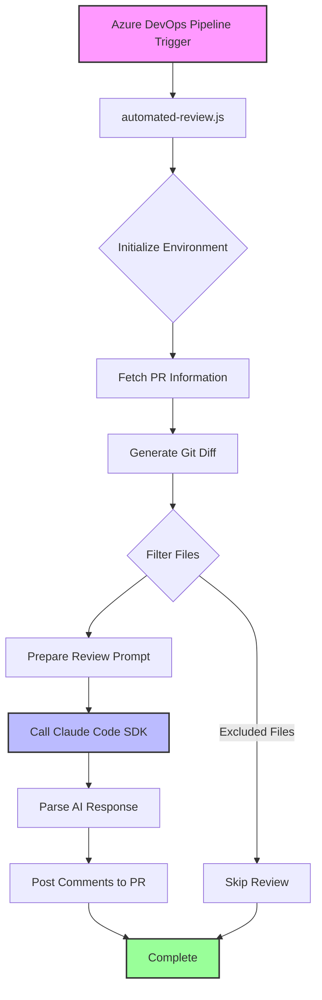

# Automated PR Review Script - Implementation Plan

## Overview
The script will integrate with Azure DevOps pipelines to automatically review code changes in pull requests using Claude AI, then post the feedback as PR comments.

## Architecture Diagram



## Detailed Implementation Plan

### 1. Project Setup and Dependencies
```json
{
  "name": "automated-pr-review",
  "version": "1.0.0",
  "type": "module",
  "dependencies": {
    "@anthropic-ai/claude-code": "latest",
    "axios": "^1.6.0",
    "simple-git": "^3.20.0",
    "minimatch": "^9.0.0"
  },
  "devDependencies": {
    "@types/node": "^20.0.0",
    "typescript": "^5.0.0"
  }
}
```

### 2. Core Components

#### A. Environment Configuration
- Read Azure DevOps environment variables:
  - `SYSTEM_ACCESSTOKEN` - Authentication token
  - `COLLECTION_URI` - Azure DevOps organization URL
  - `TEAM_PROJECT` - Project name
  - `REPO_NAME` - Repository name
  - `PR_ID` - Pull Request ID
  - `BUILD_SOURCEBRANCH` - Source branch
  - `SYSTEM_PULLREQUEST_TARGETBRANCH` - Target branch

#### B. Git Diff Generation
```javascript
// Using simple-git to generate unified diff
const git = simpleGit();
const diff = await git.diff([
  `origin/${targetBranch}...origin/${sourceBranch}`,
  '--unified=3'
]);
```

#### C. File Filtering Logic
Exclude patterns:
- `*.designer.cs` - Generated designer files
- `*.g.cs` - Generated code files
- `*.min.js` - Minified JavaScript
- `*.min.css` - Minified CSS
- Binary files (images, executables, etc.)
- Files larger than 500KB
- `node_modules/**`
- `bin/**`, `obj/**`
- `.git/**`

#### D. Claude Integration
```javascript
const reviewPrompt = `
${promptTemplate}

File Path: ${filePath}
Existing Comments: ${JSON.stringify(existingComments)}

Diff:
${unifiedDiff}
`;

const messages = [];
for await (const message of query({
  prompt: reviewPrompt,
  abortController: new AbortController(),
  options: {
    maxTurns: 1,
  },
})) {
  messages.push(message);
}
```

#### E. Azure DevOps API Integration
Key endpoints:
1. Get PR details: `GET {collection}/{project}/_apis/git/repositories/{repositoryId}/pullrequests/{pullRequestId}`
2. Get existing threads: `GET {collection}/{project}/_apis/git/repositories/{repositoryId}/pullrequests/{pullRequestId}/threads`
3. Create thread: `POST {collection}/{project}/_apis/git/repositories/{repositoryId}/pullrequests/{pullRequestId}/threads`

### 3. Error Handling and Resilience
- Retry logic for API calls (3 attempts with exponential backoff)
- Graceful handling of Claude API errors
- Validation of AI responses before posting
- Logging for debugging and monitoring

### 4. Script Structure
```
automated-pr-review/
├── package.json
├── tsconfig.json
├── tools/
│   ├── automated-review.js (compiled output)
│   └── automated-review.ts (source)
├── src/
│   ├── config.ts          # Configuration and constants
│   ├── git-utils.ts       # Git operations
│   ├── azure-devops.ts    # ADO API client
│   ├── claude-reviewer.ts # Claude integration
│   ├── file-filter.ts     # File filtering logic
│   └── types.ts           # TypeScript interfaces
└── prompts/
    └── review-prompt.txt   # Review prompt template
```

### 5. Key Features
1. **Batch Processing**: Review all files in a single Claude request for better context
2. **Deduplication**: Check existing comments to avoid duplicates
3. **Smart Filtering**: Exclude generated and binary files
4. **Structured Output**: Parse Claude's JSON response and map to ADO thread format
5. **Line Mapping**: Convert diff line numbers to file line numbers for accurate comment placement

### 6. Testing Strategy
- Unit tests for individual components
- Integration test with mock Azure DevOps API
- Local testing script that simulates pipeline environment
- Dry-run mode that logs comments without posting

## Implementation Timeline
1. **Phase 1**: Set up project structure and dependencies (Day 1)
2. **Phase 2**: Implement git diff generation and file filtering (Day 2)
3. **Phase 3**: Integrate Claude Code SDK (Day 3)
4. **Phase 4**: Implement Azure DevOps API client (Day 4)
5. **Phase 5**: Testing and refinement (Day 5)

## Security Considerations
- Use Azure DevOps System Access Token (no hardcoded credentials)
- Validate and sanitize all inputs
- Implement rate limiting for API calls
- Log sensitive operations for audit trail

## Environment Variables Required
- `SYSTEM_ACCESSTOKEN`: Azure DevOps access token
- `COLLECTION_URI`: Azure DevOps collection URI
- `TEAM_PROJECT`: Team project name
- `REPO_NAME`: Repository name
- `PR_ID`: Pull request ID
- `BUILD_SOURCEBRANCH`: Source branch name
- `SYSTEM_PULLREQUEST_TARGETBRANCH`: Target branch name

## Usage
The script will be executed automatically by the Azure DevOps pipeline when a PR is created or updated. It will:
1. Fetch the PR changes using git diff
2. Filter out excluded files
3. Send the changes to Claude for review
4. Parse the response and post comments back to the PR

## Next Steps
1. Create the project structure and install dependencies
2. Implement core modules following the plan
3. Test locally with sample data
4. Deploy to Azure DevOps pipeline